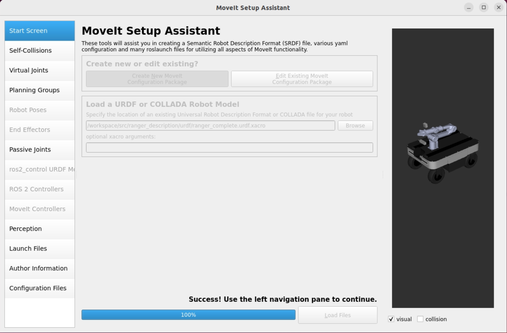

# ROS 2 MoveIt Workspace

A generic, containerized workspace for creating MoveIt configurations for any robot using the MoveIt Setup Assistant. Works with any ROS 2 Humble-compatible robot description.



## 🚀 Quick Start

### First-Time Setup (Cloning the Repository)

If you're cloning this repository for the first time:

```bash
# Clone with submodules
git clone --recurse-submodules https://github.com/anh0001/ros2-moveit-workspace.git
cd ros2-moveit-workspace
```

**OR** if you already cloned without submodules:

```bash
cd ros2-moveit-workspace
git submodule update --init --recursive
```

This will initialize the `src/rviz` submodule which contains bug fixes for the MoveIt Setup Assistant.

### Standard Usage

1. **X11 Display Setup** (automatic):
   - The container **auto-detects** your X11 display (`:0`, `:1`, etc.)
   - X11 access is automatically enabled during container build
   - **Manual override**: `export X11_DISPLAY=:0` before rebuilding
   - See [`.devcontainer/X11-CONFIG.md`](.devcontainer/X11-CONFIG.md) for details

2. **Add your robot packages** to `src/`:
   ```bash
   cd src/
   # Copy, clone, or symlink your robot description packages
   cp -r /path/to/your_robot_description .
   ```

3. **Open in VSCode and rebuild container**:
   ```bash
   code .  # Open in VSCode
   # Press F1 → "Dev Containers: Rebuild and Reopen in Container"
   ```

   **Note:** If using SSH X11 forwarding:
   ```bash
   ls -l ~/.Xauthority  # Verify .Xauthority exists
   # Prefer trusted forwarding: ssh -Y <user>@<docker-host>
   ```

4. **Build and launch Setup Assistant**:
   ```bash
   # Inside container
   cd /workspace
   colcon build --symlink-install
   source install/setup.bash
   
   # Stability flags are now built into the devcontainer env
   ros2 launch moveit_setup_assistant setup_assistant.launch.py
   ```

5. **Follow the Setup Assistant GUI** to create your MoveIt configuration

6. **Test the generated config**:
   ```bash
   ros2 launch your_robot_moveit demo.launch.py
   ```

## Common Commands (Inside Container)

```bash
# Build all packages
cb                    # alias: cd /workspace && colcon build --symlink-install

# Build specific package
cbs package_name      # alias: colcon build --symlink-install --packages-select

# Source workspace
setup                 # alias: source /workspace/install/setup.bash

# Clean build
rm -rf build install log && colcon build --symlink-install
```

## Docker CLI (Without VSCode)

```bash
cd ~/codes/ros2-moveit-workspace/.devcontainer
docker-compose build            # Build container
xhost +local:docker && docker-compose up -d   # Start container
docker exec -it ros2-moveit-workspace bash     # Attach
docker-compose down             # Stop
```

## Setup Assistant Steps

1. **Load URDF**: `/workspace/src/your_robot_description/urdf/robot.urdf.xacro`
2. **Self-Collisions**: Generate with 10000 samples
3. **Virtual Joints**: `base_link` → `world` (fixed)
4. **Planning Groups**: Arm (kinematic chain + KDL solver), Gripper (joints only, no solver)
5. **Robot Poses**: Define home, stowed, ready, open, closed
6. **End Effectors**: Link gripper group to arm group
7. **Passive Joints**: Mark wheels, casters
8. **Controllers**: Auto-add FollowJointTrajectory
9. **Author Info**: Your name/email
10. **Generate**: Save to `/workspace/src/your_robot_moveit`

## Example Robot Configurations

<details>
<summary><b>Ranger Garden Assistant (Mobile Manipulator)</b></summary>

- **URDF**: `ranger_description/urdf/ranger_complete.urdf.xacro`
- **Virtual Joint**: `base_footprint` → `map`, fixed (or planar for mobile manipulation)
- **Planning Groups**: `piper_arm` (chain: `piper_world` → `piper_link_6`, KDL solver), `piper_gripper` (`piper_joint_gripper`, no solver)
- **End Effector**: `piper_gripper` on `piper_link_6`, parent group `piper_arm`
- **Passive Joints**: all wheel and steering joints (`fl_wheel`, `fr_wheel`, etc.)
- **Save to**: `/workspace/src/ranger_piper_moveit`
</details>

<details>
<summary><b>Universal Robots UR5</b></summary>

- **URDF**: `ur_description/urdf/ur5.urdf.xacro`
- **Virtual Joint**: `base_link` → `world`, fixed
- **Planning Group**: `manipulator` (chain: `base_link` → `tool0`, KDL solver)
- **Poses**: home, up, ready
- **Save to**: `/workspace/src/ur5_moveit`
</details>

<details>
<summary><b>Franka Emika Panda (7-DOF)</b></summary>

- **URDF**: `franka_description/robots/panda_arm.urdf.xacro`
- **Virtual Joint**: `panda_link0` → `world`, fixed
- **Planning Groups**: `panda_arm` (chain: `panda_link0` → `panda_link8`, KDL solver), `hand` (`panda_finger_joint1`, `panda_finger_joint2`, no solver)
- **End Effector**: `hand` on `panda_link8`, parent group `panda_arm`
- **Save to**: `/workspace/src/panda_moveit`
</details>

<details>
<summary><b>Custom Robot from Scratch</b></summary>

```bash
cd ~/codes/ros2-moveit-workspace/src/
mkdir -p my_robot_description/{urdf,meshes/visual,meshes/collision,launch,config}
# Add your URDF/xacro, meshes, package.xml, and CMakeLists.txt
# Then build: colcon build --symlink-install --packages-select my_robot_description
```

Before using the Setup Assistant, validate your URDF:
```bash
xacro your_robot.urdf.xacro > /tmp/robot.urdf && check_urdf /tmp/robot.urdf
```
</details>

## File Paths

| Location | Container | Host |
|----------|-----------|------|
| Workspace | `/workspace` | `~/codes/ros2-moveit-workspace` |
| Source packages | `/workspace/src` | `~/codes/ros2-moveit-workspace/src` |
| Generated config | `/workspace/src/*_moveit` | `~/codes/ros2-moveit-workspace/src/*_moveit` |
| Build artifacts | `/workspace/build` | `~/codes/ros2-moveit-workspace/build` |

## What This Workspace Provides

- ✅ Pre-configured development container with MoveIt 2 and all dependencies
- ✅ X11 forwarding for GUI applications (Setup Assistant, RViz)
- ✅ NVIDIA GPU support for visualization
- ✅ Works with any ROS 2 Humble robot description
- ✅ VSCode integration with ROS extensions
- ✅ Isolated environment (doesn't affect your host ROS installation)

## 📁 Workspace Structure

```
ros2-moveit-workspace/
├── .devcontainer/          # Development container configuration
│   ├── Dockerfile          # Container image definition
│   ├── devcontainer.json   # VSCode devcontainer config
│   ├── docker-compose.yml  # Docker Compose setup
│   └── README.md           # Detailed usage instructions
├── src/                    # Place your robot packages here
│   ├── your_robot_description/
│   ├── your_robot_moveit/  # Generated MoveIt config (after setup)
│   └── ...
├── scripts/                # Helper scripts
│   └── setup.sh            # Quick setup script
├── build/                  # Build artifacts (gitignored)
├── install/                # Install space (gitignored)
├── log/                    # Build logs (gitignored)
└── README.md               # This file
```

## 🛠️ Supported Use Cases

This workspace is designed for:

- **Creating new MoveIt configurations** for custom robots
- **Testing robot URDFs** before deploying to hardware
- **Educational purposes** - learning MoveIt without installing on host
- **Cross-platform development** - works on any system with Docker
- **ARM/Jetson development** - run Setup Assistant on x86_64 for ARM robots

## 🤖 Example Robots

Works with any robot, including:

- Industrial arms (UR, KUKA, ABB, etc.)
- Collaborative robots (Franka Emika, Universal Robots, etc.)
- Mobile manipulators (TurtleBot with arm, custom platforms)
- Custom robot designs
- Multi-arm systems

## 📋 Requirements

- Docker (with NVIDIA runtime for GPU support)
- VSCode with Dev Containers extension (recommended)
- X11 server (for GUI applications)
- Robot URDF/xacro description packages

## 💡 Tips

1. **Keep your robot packages under version control** - the `src/` directory is for your code
2. **Generated MoveIt configs** should also be committed to git
3. **Clean builds when switching** between container and host
4. **Use the demo launch file** to test before connecting hardware
5. **Refer to devcontainer README** for troubleshooting
6. **Rebuild devcontainer after updates** so the latest graphics stability defaults are applied

## 🐛 Troubleshooting

### Setup Assistant Crashes (Segmentation Fault)

The MoveIt Setup Assistant may crash with a segfault in `rviz_common::properties::PropertyTreeModel::propertyHiddenChanged`. This is a known use-after-free bug in rviz_common ([ros2/rviz#1587](https://github.com/ros2/rviz/pull/1587), [ros2/rviz#1620](https://github.com/ros2/rviz/issues/1620)) that is not fully fixed in the binary packages (up to 11.2.25).

**Fix:** This workspace includes a patched `rviz_common` built from source at `src/rviz/`. Build it inside the container:

```bash
cd /workspace
colcon build --symlink-install
source install/setup.bash
ros2 launch moveit_setup_assistant setup_assistant.launch.py
```

The patch adds `QPointer` guards to `Property::setModel()` to prevent dangling pointer access, and fixes the `parent()` vs `getParent()` regression in `PropertyTreeWidget`.

### Remote Access (SSH X11 Forwarding Does NOT Work)

SSH X11 forwarding (`ssh -X` / `ssh -Y`) does **not** work reliably with RViz/OpenGL — you will get rendering errors or blank windows. You need a **direct display connection** to the host running Docker.

**Recommended for remote access:** Use a remote desktop tool such as [AnyDesk](https://anydesk.com/), VNC, or RDP to connect to the Ubuntu host, then open VSCode and the container there.

Tested on: **Ubuntu 22.04** host with direct display, remote from macOS via AnyDesk.

### X11 Connection Issues

The container automatically detects and configures your X11 display. If you have issues:

```bash
# Check detected display
cat .devcontainer/.display.env

# Manually override if needed (on host, before rebuild)
export X11_DISPLAY=:0  # or :1, :2, etc.

# Inside container, test X11:
xeyes  # Should show a window
glx-check  # Check OpenGL capabilities
```

**Note:** X11 access is now automatically enabled during container initialization. No manual `xhost` command needed unless rebuilding fails.

For detailed X11 configuration options, see [`.devcontainer/X11-CONFIG.md`](.devcontainer/X11-CONFIG.md).

### GPU/Graphics Issues

```bash
# Test with safe RViz:
rviz2-safe

# Check GPU access:
nvidia-smi  # Should show GPU if hardware acceleration is available
```

## 🔗 Resources

- [MoveIt 2 Documentation](https://moveit.picknik.ai/humble/)
- [ROS 2 Humble Documentation](https://docs.ros.org/en/humble/)
- [VSCode Dev Containers](https://code.visualstudio.com/docs/devcontainers/containers)
- [Docker Documentation](https://docs.docker.com/)

## 📝 License

This workspace configuration is provided as-is for use with ROS 2 and MoveIt 2.

## 🤝 Contributing

Feel free to adapt this workspace for your needs. If you find improvements, consider sharing them!

---

**Need help?** Check the [detailed devcontainer documentation](.devcontainer/README.md) or refer to the [MoveIt community forums](https://github.com/moveit/moveit2/discussions).
